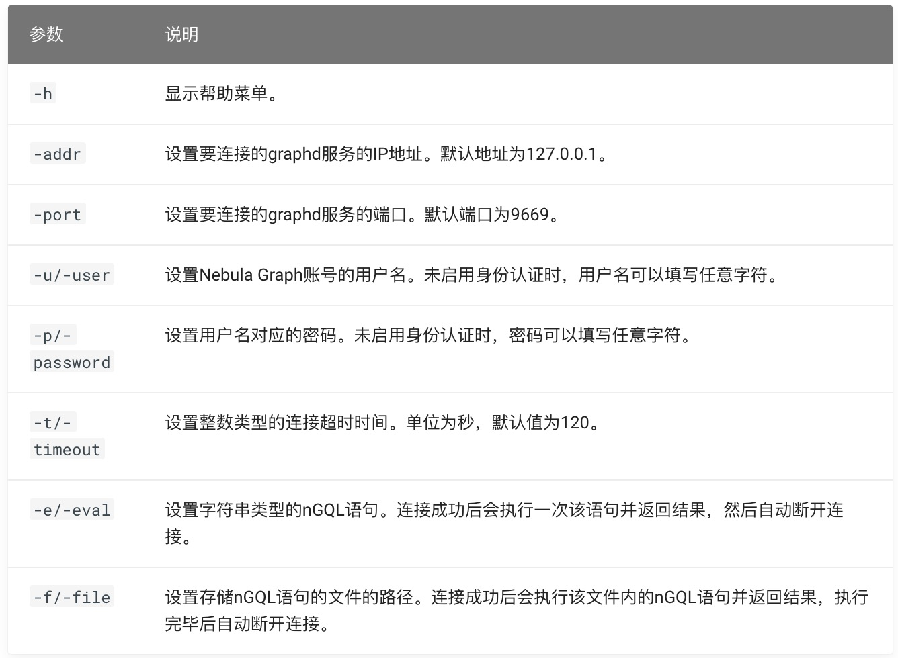
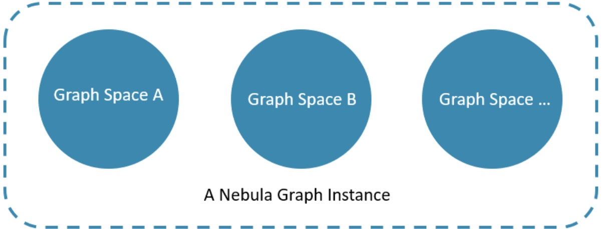

# Docker Compose搭建Nebula

## 部署和链接Nebula

* 下载docker-compose配置

```shell
git clone https://github.com/vesoft-inc/nebula-docker-compose.git
```

* 构建nebula集群

```shell
docker-compose up -d
```

* 链接Nebula Graph

```shell
# 启动nebula console
docker run --rm -ti --network nebula-docker-compose_nebula-net --entrypoint=/bin/sh vesoft/nebula-console:v2-nightly
# 链接nebula graph
nebula-console -u user -p password --address=graphd --port=9669
```

# 管理Nebula Graph服务

* Nebula Graph使用脚本`nebula.service`管理服务，包括启动、停止、重启、中止和查看。
* `nebula.service`的默认路径是`/usr/local/nebula/scripts`，如果修改过安装路径，请使用实际路径。

```shell
sudo /usr/local/nebula/scripts/nebula.service 
[-v] [-c <config_file_path>] 
<start|stop|restart|kill|status> 
<metad|graphd|storaged|all>
```

* -v:显示详细调试信息
* -c:指定配置文件路径，默认路径为/user/lical/nebula/etc/
* metad:管理meta服务
* graph:管理graph服务
* storaged:管理storage服务
* all:管理所有服务

## 启动Nebula garph服务

```shell
# 非容器部署
sudo /usr/local/nebula/scripts/nebula.service start all
# 容器部署
docker-compose up -d
```

## 停止Nebula Graph服务

* 禁止使用kill -9方式停止服务，存在数据丢失概率。

```shell
# 非容器
sudo /usr/local/nebula/scripts/nebula.service stop all
# 容器
docker-compose down
```

## 查看Nebula Graph服务

```
# 非容器
sudo /usr/local/nebula/scripts/nebula.service status all
```

# 连接Nebula Graph

## Nebula Console

```shell
nebula-console.exe -addr <ip> -port <port> -u <username> -p <password>
[-t 120] [-e "nGQL_statement" | -f filename.nGQL]
```



## Nebula Console导出模式

* 导出模式开启时，Nebula Console会导出所有请求的结果到CSV格式文件中。关闭导出模式会停止导出。使用语法如下：
* 开启导出模式

```shell
:SET CSV <test.csv>	
```

* 关闭导出模式

```
:UNSET CSV
```

# 基本操作语法

## 图空间和Schema

* 一个Nebula Graph实例由一个或多个图空间组成。每个图空间都是物理隔离的，用户可以在同一个实例中使用不同的图空间存储不同的数据集。



* Nebula Graph在图空间中定义了Schema
  * 点(vertex):表示现实世界中的实体。一个点可以有一个或多个标签。
  * 标签(tag):点的类型，定义了一组描述点类型的属性。
  * 边(edge):标识两个点之间有方向的关系。
  * 边类型(edge type):边的类型，定义了一组描述边类型的属性。


## 异步实现创建和修改

**Nebula Graph中执行如下创建和修改操作，是异步实现的，需要在下一个心跳周期才同步数据。**

* `CREATE SPACE`
* `CREATE TAG`
* `CREATE EDGE`
* `ALTER TAG`
* `ALTER EDGE`
* `CREATE TAG INDEX`
* `CREATE EDGE INDEX`

**默认心跳周期是10秒。修改心跳周期参数`heartbeat_interval_secs`**

* 确保数据同步后续操作能顺利进行，需要以下方法之一：

  * 执行`SHOW`或`DESCRIBE`命令检查相应对象的状态，确保创建或修改已完成。如果没有完成，请等待几秒重试。

  - 等待2个心跳周期（20秒）。

## 创建和选择图空间

* 创建图空间

```shell
CREATE SPACE [IF NOT EXISTS] <graph_space_name>
    [(partition_num = <partition_number>, 
    replica_factor = <replica_number>, 
    vid_type = {FIXED_STRING(<N>) | INT64})];
    
 # 创建test
 CREATE SPACE IF NOT EXISTS test_graph_space(PARTITION_NUM=5,REPLICA_FACTOR=1,VID_TYPE=INT64);
```

| 参数           | 说明                                                         |
| -------------- | ------------------------------------------------------------ |
| partition_num  | 指定图空间的分片数量。建议设置为5倍的集群硬盘数量。例如集群中有3个硬盘，建议设置15个分片。 |
| replica_factor | 指定每个分片的副本数量。建议在生产环境中设置为3，在测试环境中设置为1。由于需要进行基于quorum的选举，副本数量必须是**奇数**。 |
| vid_type       | 指定点ID的数据类型。可选值为`FIXED_STRING(<N>)`和`INT64`。`FIXED_STRING(<N>)`表示数据类型为字符串，最大长度为`N`，超出长度会报错；`INT64`表示数据类型为整数。默认值为`FIXED_STRING(8)`。 |

* 查看全部图空间

```shell
show spaces;
```

* 使用指定图空间

```shell
use space_name
```

## 创建标签和边类型

```shell
CREATE {TAG | EDGE} {<tag_name> | <edge_type>}(<property_name> <data_type>
[, <property_name> <data_type> ...]);

# 创建tag player
nebula> CREATE TAG player(name string, age int);

# 创建tag team
nebula> CREATE TAG team(name string);

# 创建边follow
nebula> CREATE EDGE follow(degree int);

# 创建边serve
nebula> CREATE EDGE serve(start_year int, end_year int);
```

## 插入点和边

* 使用INSERT基于存在的tag插入点或者edgeType插入边

### 插入点

```shell
INSERT VERTEX <tag_name> (<property_name>[, <property_name>...])
[, <tag_name> (<property_name>[, <property_name>...]), ...]
{VALUES | VALUE} <vid>: (<property_value>[, <property_value>...])
[, <vid>: (<property_value>[, <property_value>...];

# 插入球员和球队的点
# player
INSERT VERTEX player(name,age) VALUES 100:("kobe",24);
INSERT VERTEX player(name,age) VALUES 101:("james",38);
INSERT VERTEX player(name,age) VALUES 102:("ow",27)
# team
INSERT VERTEX team(name) VALUES 24:("laker");
```

* `VID`是Vertex ID的缩写，`VID`在一个图空间中是唯一的。

### 插入边

```shell
INSERT EDGE <edge_type> (<property_name>[, <property_name>...])
{VALUES | VALUE} <src_vid> -> <dst_vid>[@<rank>] : (<property_value>[, <property_value>...])
[, <src_vid> -> <dst_vid>[@<rank>] : (<property_name>[, <property_name>...]), ...];

# 插入代表球员和球队关系的边
# 插入球员关系边
INSERT EDGE follow(degree) VALUES 100->101:(95);
INSERT EDGE follow(degree) VALUES 100->101@1:(95);

# 插入球员球队关系边
INSERT EDGE serve(start_year,end_year) VALUES 100 ->24:(1996,2010),101->23:(2003,2008);
```

## 查询数据

* [GO](https://docs.nebula-graph.com.cn/2.0.1/3.ngql-guide/7.general-query-statements/3.go/)语句可以根据指定的条件遍历数据库。`GO`语句从一个或多个点开始，沿着一条或多条边遍历，返回`YIELD`子句中指定的信息。

```shell
GO [[<M> TO] <N> STEPS ] FROM <vertex_list>
OVER <edge_type_list> [REVERSELY] [BIDIRECT]
[WHERE <expression> [AND | OR expression ...])]
YIELD [DISTINCT] <return_list>;
```

- [FETCH](https://docs.nebula-graph.com.cn/2.0.1/3.ngql-guide/7.general-query-statements/4.fetch/)语句可以获得点或边的属性。

  - 查询标签属性

  ```shell
  FETCH PROP ON {<tag_name> | <tag_name_list> | *} <vid_list>
  [YIELD [DISTINCT] <return_list>];
  ```

  - 查询边属性

```
FETCH PROP ON <edge_type> <src_vid> -> <dst_vid>[@<rank>]
[, <src_vid> -> <dst_vid> ...]
[YIELD [DISTINCT] <return_list>];
```

- [LOOKUP](https://docs.nebula-graph.com.cn/2.0.1/3.ngql-guide/7.general-query-statements/5.lookup/)语句是基于[索引](https://docs.nebula-graph.com.cn/2.0.1/2.quick-start/4.nebula-graph-crud/#_14)的，和`WHERE`子句一起使用，查找符合特定条件的数据。

```
LOOKUP ON {<tag_name> | <edge_type>} 
WHERE <expression> [AND expression ...])]
[YIELD <return_list>];
```

- [MATCH](https://docs.nebula-graph.com.cn/2.0.1/3.ngql-guide/7.general-query-statements/2.match/)语句是查询图数据最常用的，但是它依赖[索引](https://docs.nebula-graph.com.cn/2.0.1/2.quick-start/4.nebula-graph-crud/#_14)去匹配Nebula Graph中的数据模型。

```
MATCH <pattern> [<WHERE clause>] RETURN <output>;
```

### Go查询

* YIELD:指定该查询需要返回的值或结果。
* $$:表示边的终点
* $^:表示边的起点
* |:组合多个查询的管道符，将前一个查询的结果集用于后一个查询。
* $-:表示管道符前面的查询输出的结果集。

## 修改点和边

