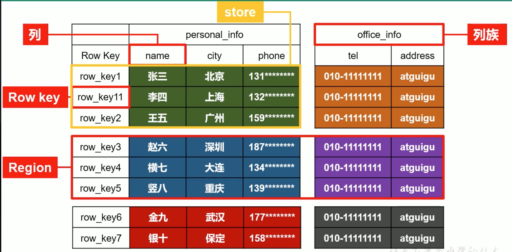
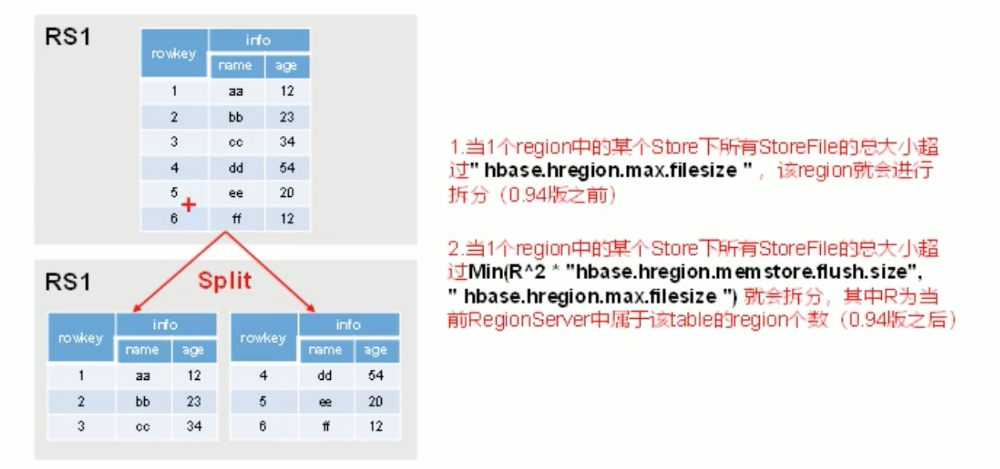

# 概述

## 特点

- 不支持复杂的事务，只支持行级事务，即单行数据的读写都是原子性的；
- 由于是采用 HDFS 作为底层存储，所以和 HDFS 一样，支持结构化、半结构化和非结构化的存储；
- 支持通过增加机器进行横向扩展；
- 支持数据分片；
- 支持 RegionServers 之间的自动故障转移；
- 易于使用的 Java 客户端 API；
- 支持 BlockCache 和布隆过滤器；
- 过滤器支持谓词下推。

## 定义

* Hbase是一个在HDFS上开发的面向列的分布式、可扩展支持海量数据存储的NoSQL数据库，如果需要实时访问超大规模数据集可以使用。
* 自底向上地进行构建，能够简单地通过增加节点来达到线性扩展。

## 数据模型

* 逻辑上，Hbase的数据模型同关系型数据库很类似，数据存储在一张表中，有行有列。但从Hbase的底层物理存储结构(K-V)来看，Hbase更像是一个`multi-dimensional map`

### Hbase的逻辑结构



* 按照RowKey横向切分成一个个的Region，按照列族纵向切分。
* Store为真正存储到HDFS的数据。

### 表特点

- 容量大：一个表可以有数十亿行，上百万列；
- 面向列：数据是按照列存储，每一列都单独存放，数据即索引，在查询时可以只访问指定列的数据，有效地降低了系统的 I/O 负担；
- 稀疏性：空 (null) 列并不占用存储空间，表可以设计的非常稀疏 ；
- 数据多版本：每个单元中的数据可以有多个版本，按照时间戳排序，新的数据在最上面；
- 存储类型：所有数据的底层存储格式都是字节数组 (byte[])。

### 物理结构


#### Name Sparce

* 命名空间，类似于关系型数据库的`database`概念，每个命名空间下有多个表。Hbase有`两个自带的命名空间`，分别为hbase和default，`hbase中存放的是Hbase内置的表，default表示用户默认使用的命名空间`。

#### Region

* 类似于关系型数据库的表概念，不同的是，Hbase定义表时只需要声明`列族`即可，不需要声明具体的列。这意味着Hbase写入数据时，字段可以`动态，按需`指定。因此，和关系型数据库相比，Hbase能够处理字段变更场景。
* Region也相当于表的切片，按照RowKey来切分Hbase的表。

#### Row

* HBase表中的每行数据都由一个`RowKey`和多个`Column(列)`组成，数据是按照RowKey的`字典顺序存储`的，并且查询数据时只能根据RowKey进行检索，所有RowKey的设计十分重要。

#### Row key(行键)

`Row Key` 是用来检索记录的主键。想要访问 HBase Table 中的数据，只有以下三种方式：

- 通过指定的 `Row Key` 进行访问；
- 通过 Row Key 的 range 进行访问，即访问指定范围内的行；
- 进行全表扫描。

`Row Key` 可以是任意字符串，存储时数据按照 `Row Key` 的字典序进行排序。这里需要注意以下两点：

- 因为字典序对 Int 排序的结果是 1,10,100,11,12,13,14,15,16,17,18,19,2,20,21,…,9,91,92,93,94,95,96,97,98,99。如果你使用整型的字符串作为行键，那么为了保持整型的自然序，行键必须用 0 作左填充。
- 行的一次读写操作时原子性的 (不论一次读写多少列)。

#### Column Family（列族）

HBase 表中的每个列，都归属于某个列族。列族是表的 Schema 的一部分，所以列族需要在创建表时进行定义。列族的所有列都以列族名作为前缀，例如 `courses:history`，`courses:math` 都属于 `courses` 这个列族。

#### Column Qualifier (列限定符)

列限定符，你可以理解为是具体的列名，例如 `courses:history`，`courses:math` 都属于 `courses` 这个列族，它们的列限定符分别是 `history` 和 `math`。需要注意的是列限定符不是表 Schema 的一部分，你可以在插入数据的过程中动态创建列。

#### Column(列)

HBase 中的列由列族和列限定符组成，它们由 `:`(冒号) 进行分隔，即一个完整的列名应该表述为 `列族名 ：列限定符`。

#### Cell

`Cell` 是行，列族和列限定符的组合，并包含值和时间戳。你可以等价理解为关系型数据库中由指定行和指定列确定的一个单元格，但不同的是 HBase 中的一个单元格是由多个版本的数据组成的，每个版本的数据用时间戳进行区分。

#### Timestamp(时间戳)

HBase 中通过 `row key` 和 `column` 确定的为一个存储单元称为 `Cell`。每个 `Cell` 都保存着同一份数据的多个版本。版本通过时间戳来索引，时间戳的类型是 64 位整型，时间戳可以由 HBase 在数据写入时自动赋值，也可以由客户显式指定。每个 `Cell` 中，不同版本的数据按照时间戳倒序排列，即最新的数据排在最前面。

## 存储结构

### Regions

HBase Table 中的所有行按照 `Row Key` 的字典序排列。HBase Tables 通过行键的范围 (row key range) 被水平切分成多个 `Region`, 一个 `Region` 包含了在 start key 和 end key 之间的所有行。

<div align="center">  </div>

每个表一开始只有一个 `Region`，随着数据不断增加，`Region` 会不断增大，当增大到一个阀值的时候，`Region` 就会等分为两个新的 `Region`。当 Table 中的行不断增多，就会有越来越多的 `Region`。

<div align="center">  </div>

`Region` 是 HBase 中**分布式存储和负载均衡的最小单元**。这意味着不同的 `Region` 可以分布在不同的 `Region Server` 上。但一个 `Region` 是不会拆分到多个 Server 上的。

<div align="center">  </div>

### Region Server

`Region Server` 运行在 HDFS 的 DataNode 上。它具有以下组件：

- **WAL(Write Ahead Log，预写日志)**：用于存储尚未进持久化存储的数据记录，以便在发生故障时进行恢复。
- **BlockCache**：读缓存。它将频繁读取的数据存储在内存中，如果存储不足，它将按照 `最近最少使用原则` 清除多余的数据。
- **MemStore**：写缓存。它存储尚未写入磁盘的新数据，并会在数据写入磁盘之前对其进行排序。每个 Region 上的每个列族都有一个 MemStore。
- **HFile** ：将行数据按照 Key\Values 的形式存储在文件系统上。

<div align="center">  </div>

Region Server 存取一个子表时，会创建一个 Region 对象，然后对表的每个列族创建一个 `Store` 实例，每个 `Store` 会有 0 个或多个 `StoreFile` 与之对应，每个 `StoreFile` 则对应一个 `HFile`，HFile 就是实际存储在 HDFS 上的文件
<div align="center">  </div>


## Hbase的基本架构

### HBase架构(不完整版)

.jpg)

#### **Zookeeper**

1. 保证任何时候，集群中只有一个 Master；
2. 存贮所有 Region 的寻址入口；
3. 实时监控 Region Server 的状态，将 Region Server 的上线和下线信息实时通知给 Master；
4. 存储 HBase 的 Schema，包括有哪些 Table，每个 Table 有哪些 Column Family 等信息。

#### Region Server

* Region Server为Region的管理者，其实现类为`HRegionServer`,主要作用如下:对于数据的操作:get、put、delete。
* Region Server 负责维护 Master 分配给它的 Region ，并处理发送到 Region 上的 IO 请求；
* Region Server 负责切分在运行过程中变得过大的 Region。

<div align="center">  </div>

#### Master

* Master是所有Region Server的管理者，其实现类为`HMaster`,监控每个RegionServer的状态，负载均衡和故障转移。
* 为 Region Server 分配 Region ；
* 负责 Region Server 的负载均衡 ；
* 发现失效的 Region Server 并重新分配其上的 Region；
* GFS 上的垃圾文件回收；
* 处理 Schema 的更新请求。

#### HDFS

* HDFS为HBase提供最终的底层数据存储服务，同为HBase提供高可用的支持。

### HBASE架构(完整版)

.jpg)

#### StoreFile

* 保存实际数据的物理文件，StoreFile以Hfile的形式存储在HDFS上。每个Store会有一个或多个StoreFile(HFile),数据在每个StoreFIle中都是有序的。

#### MemStore

* 写缓存，由于HFile中的数据要求是有序的，所以数据时先存储在MemStore中，排好序后，等达到刷写时机才会刷写到HFile，每次刷写都会形成一个新的HFile。

#### WAL

* 由于数据要经过MemStore排序后才能刷写到HDFS，但把数据保存在内存中会有很高的概率导致数据丢失，为了解决这个问题，数据会先写在一个叫作Write-Ahead logfile的文件中，然后再写入MemStore中。所以在系统出现故障的时候，数据可以通过这个日志文件重建。

# HBase快速入门

## Hbase按照部署

### 下载Hbase压缩包

```shell
curl https://mirror.bit.edu.cn/apache/hbase/2.3.0/
```

### 修改配置

* 修改regionservers

```
hadoop
```

* 修改hbase-env.sh

```properties
# 添加JAVA_HOME
export JAVA_HOME=/Library/Java/JavaVirtualMachines/jdk1.8.0_221.jdk/Contents/Home
# 不使用HBase内置的ZK
export HBASE_MANAGES_ZK=false
```

* 修改hbase-site.xml

```xml
<?xml version="1.0"?>
<?xml-stylesheet type="text/xsl" href="configuration.xsl"?>
<!--
/*
 * Licensed to the Apache Software Foundation (ASF) under one
 * or more contributor license agreements.  See the NOTICE file
 * distributed with this work for additional information
 * regarding copyright ownership.  The ASF licenses this file
 * to you under the Apache License, Version 2.0 (the
 * "License"); you may not use this file except in compliance
 * with the License.  You may obtain a copy of the License at
 *
 *     http://www.apache.org/licenses/LICENSE-2.0
 *
 * Unless required by applicable law or agreed to in writing, software
 * distributed under the License is distributed on an "AS IS" BASIS,
 * WITHOUT WARRANTIES OR CONDITIONS OF ANY KIND, either express or implied.
 * See the License for the specific language governing permissions and
 * limitations under the License.
 */
-->
<configuration>
  <!--
    The following properties are set for running HBase as a single process on a
    developer workstation. With this configuration, HBase is running in
    "stand-alone" mode and without a distributed file system. In this mode, and
    without further configuration, HBase and ZooKeeper data are stored on the
    local filesystem, in a path under the value configured for `hbase.tmp.dir`.
    This value is overridden from its default value of `/tmp` because many
    systems clean `/tmp` on a regular basis. Instead, it points to a path within
    this HBase installation directory.

    Running against the `LocalFileSystem`, as opposed to a distributed
    filesystem, runs the risk of data integrity issues and data loss. Normally
    HBase will refuse to run in such an environment. Setting
    `hbase.unsafe.stream.capability.enforce` to `false` overrides this behavior,
    permitting operation. This configuration is for the developer workstation
    only and __should not be used in production!__

    See also https://hbase.apache.org/book.html#standalone_dist
  -->
  <!--开启分布式模式-->
  <property>
    <name>hbase.cluster.distributed</name>
    <value>true</value>
  </property>
  <!--添加hbase数据存储目录为HDFS-->
  <property>
    <name>hbase.rootdir</name>
    <value>hdfs://hadoop:8020/hbase</value>
  </property>
  <!--hbase zk地址配置-->
   <property>
    <name>hbase.zookeeper.quorum</name>
    <value>hadoop:2182,hadoop:2183,hadoop:2184</value>
  </property>
  <!--Hbase  Master绑定端口-->
  <property >
    <name>hbase.master.port</name>
    <value>16000</value>
  </property>
  <!--Master的web ui端口-->
  <property>
    <name>hbase.master.info.port</name>
    <value>16010</value>
  </property>
  <!--zk工作目录-->
   <property>
    <name>hbase.zookeeper.property.dataDir</name>
    <value>/Users/babywang/Documents/reserch/middleware/zk/zkCluster/zookeeper_data1,/Users/babywang/Documents/reserch/middleware/zk/zkCluster/zookeeper_data2,/Users/babywang/Documents/reserch/middleware/zk/zkCluster/zookeeper_data3</value>
  </property>
</configuration>
```

### 配置Hbase环境变量

```shell
# 配置Hbase
export HBASE_HOME=/Users/babywang/Documents/reserch/studySummary/module/hbase/hbase-2.3.0
export PATH=$PATH:$HBASE_HOME/bin
```

## 启动Hbase

* 启动Master

```shell
hbase-daemon.sh start master
```

* 启动regionServer

```shell
hbase-daemon.sh start regionserver

# 如果RegionServer和Master时间不一致则无法启动RegionServer
```

# 原理深入

## 写流程


* Client先访问Zookeeper获取hbase:meta表位于哪个RegionServer下，然后在访问meta拿到写入表的RegionServer，该表即meta表会在客户端的meta cache中缓存
* Client在发送Put请求到RegionServer，RegionServer会先写数据到wal edit(预写入日志)中，然后在将数据写入内存MemStore并在MemStore中排序，向客户端发送ack，等到MemStore的刷写时机后，将数据刷写到HFile，最终同步wal edit日志，如果同步失败或者写内存失败那么存在基于MVCC多版本控制的事务，会去回滚。
* 老版本这里还有一个`-ROOT-`，先于Zookeeper之前。

## MemStore Flush


### MemStore刷写时机

* 当某个memstore的大小达到`hbase.hregion.memstore.flush.size(默认值128M)`,其所在region的所有memstore都会刷写。当memstore的大小达到`hbase.hregion.memstore.block.multiplier(默认4)`时会阻止继续往memstore写数据。
* 当region server中memstore的总大小达到java_heapsize、`hbase.regionserver.global.memstore.size(默认0.4,regionServer的0.4)`、`hbase.regionserver.global.memstore.size.lower.limit(默认值0.95，regionServer的0.4*0.95)`，region会按照其所有memstore的大小顺序(由大到小)依次进行刷写。直到region server中所有memstore的总大小减少到上述值以下。
* `hbase.regionserver.optionalcacheflushinterval`memstore内存中的文件在自动刷新之前能够存活的最长时间，默认是1h(最后一次的编辑时间)
* `老版本:`当WAL文件的数量超过`hbase.regionserver.max.logs`,region会按照时间顺序依次进行刷写，直到WAL文件数量减小到`hbase.regionser.max.log`以下。先已经废弃，默认32。

## 读流程


* Client先访问zk，获取hbase:meta表位于哪个Region Server
* 访问对应的Region Server，获取hbase:meta表，根据读请求的namespace:table/rowkey,查询出目标数据位于哪个Region Server中的哪个Region中，并将该table的region信息以及meta表的位置信息缓存在客户端的meta cache中。
* 与目标region Server通信
* `分别在Block Cache(读缓存)，memstore和store file(HFile)中查询目标数据，并将查到的数据进行合并。`此处所有数据都指向同一条数据的不同版本(timestamp)或者不同的类型(put/Delete)
* 将从文中查询的数据块(Block，HFile数据存储单元，默认大小64KB)缓存到Block Cache。
* 将合并后的结果返回客户端。

## StoreFile Compaction

* 由于memstore每次刷写都会产生一个新的Hfile，`且同一个字段的不同版本和不同类型有可能会分布在不同的Hfile中，因此查询时需要遍历所有的HFile`。为了减少HFile的个数，以及清理掉过期和删除的数据，会进行StoreFile Compaction
* Compaction为两种，分别是`Minor Compaction`和`Major Compaction`。Minor Compaction会将临近的若干个较小的HFile合并成一个较大的HFile，但`不会清理过期和删除的数据`。Major Compaction会将一个Store下的所有HFile合并成一个大HFile，并且`会清理掉过期和删除的数据`。


* `hbase.hregion.majorcompaction`
  * 一个region进行major compaction合并的周期，在这个时间的时候这个region下的所有hfile会进行合并，默认是7天，major compaction非常消耗资源，建议生产关闭该操作(设置为0)，在应用空闲时间手动触发。
* `hbase.hregion.majorcompaction.jitter`
  * 一个抖动比例上一个参数设置是7天进行一次合并，也可以有50的抖动比例
* `hbase.hstore.compactionThreshold`
  * 一个store里面运行存的hfile的个数，超过这个个数会被写到一个新的hfile里面，也即是每个region的每个列族对应的memstore在flush为hfile的时候，默认情况下当达到3个hfile的时候就会对这些文件进行合并重写为一个新文件，设置个数越大可以减少触发合并的时间，每次合并的时间就会越长。

## 真正的数据删除时间

### Major Compaction

* 大合并会将Delete标识删除

### flush将memstore数据刷写成HFile

* 不会删除Delete标识的数据，但是会删除过期数据。

## Region Split

* 默认情况下，每个Table起初只有一个Region，随着数据的不断写入，Region会自定进行拆分。刚拆分时，两个子Region都位于当前的Region Server，但处于负载均衡的考虑，HMaster有可能会将某个Region转移给其他的Region Server。
* **Region Split时机:**
  * 当1个region中的某个Store下所有StoreFile的总大小超过`hbase.hregion.max.filesize`，默认10G,该Region就会进行拆分(0.94版本之前)
  * 当1个region中的某个Store下所有StoreFile的总大小超过`Min(R^2*"hbase.hregion.memstore.flush.size(默认128MB)",hbase.hregion.max.filesie"(默认10G))`，该Region就会进行拆分，其中R为当前Region Server中属于该Table的个数(0.94版本之后)



# HBase优化

## 高可用

* HBase是主从架构，基于HMaster和HRegionServer，因此需要保证HMaster的高可用，在HBase集群中启动多个HMaster即可形成HMaster的高可用，第一个启动的为active Master，其余都为BackUpMaster。
* 配置backup-masters

```shell
hadoop1
hadoop2
```

## 预分区

* 每个region维护着StartRow与EndRow，如果加入的数据符合某个Region维护的RowKey范围，则该数据交给这个Region维护。
* 每台机器上放2-3个Region

### 手动设置预分区

```shell
create 'stu1','info','partitional',SPLITS =>['1000','2000','3000','4000']
```

### 生成16进制序列预分区

```shell
create 'stu2','info','partitional2',SPLITS =>[NUMREGIONS=>15,SPLITALGO=>'HexStringSplit']
```

### 文件分区

```shell
create 'stu3','info','partitional',SPLITS_FILE=>'splits.txt'
```

### Java API

```java
    public static void createTableName(String tableName) throws IOException {
        ColumnFamilyDescriptor student = ColumnFamilyDescriptorBuilder.newBuilder(ColumnFamilyDescriptorBuilder.of("student"))
                .setMaxVersions(1000)
                .build();
        TableDescriptor test = TableDescriptorBuilder.newBuilder(TableName.valueOf(tableName))
                .setColumnFamily(student)
                .setSplitEnabled(true)
                .build();
        byte[][] splits = new byte[5][5];
        connection.getAdmin().createTable(test);
    }
```


## RowKey设计

* 一条数据的唯一标识就是RowKey，这条数据存储在那个分区，取决于RowKey处于那个分区的区间内，设计Rowkey主要为了让数据均匀分布在每个region中。

### 设计原则

* 散列性、唯一性、长度原则(70-100)

### 设计方式

* 生成随机数、hash、散列值

```shellshe l
原本rowKey为1001的，SHA1后变为xxxxxxxxxxxx1
原本rowKey为3001的，SHA1后变为xxxxxxxxxxxx2

根据数据集中的样本来选择rowKey的Hash后作为每个分区的临界值。
```

* 字符串反转

```shell
202008081201为102180800202
202008081202为202180800202
```

* 字符串拼接

```shell
2020080800001_Xxxs
2020080800001_Xxxe
```

### 分区设计

### 分区键设计

```shell
# 300个分区
000|
001|
...
298|

|的ASC码大于_
# RowKey
000_
001_
...
298_

# 对手机号mod 299 然后拼接对应的rowKey
```

## 内存优化

* HBase操作过程需要大量的内存开销，Table是会换成在内存中的，一般会分配整个可用内存的70%给HBase的Java堆。但是不建议分配非常大的对内存，因为GC过程会持续太久导致RegionServer处于长期不可用状态，一般16～48G即可。

## 基础优化

### 运行在HDFS的文件中追加内容

* 修改hdfs-site.xml、hbase-site.xml

```shell
# 开启HDFS追加同步，可以优秀的配合HBase的数据同步和持久化。默认值为true
dfs.support.append
```

### 优化DataNode允许的最大文件打开数

```shell
# HBase一般都会同一时间操作大量的文件，根据集群的数量和规模以及数据动作，设置为4096或者更高，默认值为4096.
dfs.datanode.max.transfer.threads
```

### 优化延迟高的数据操作的等待时间

* hdfs-site.xml

```shell
# 如果对于某一次数据操作来讲，延迟非常高，socket需要等待更长时间。建议设大timeout不会让socket被timeout，但是会阻塞其他操作，默认60000毫秒。
dfs.image.transfer.timeout
```

### 优化数据的写入效率

* mapped-site.xml

```shell
# 开启这两个数据可以大大提高文件的写入效率，减少写入时间。文件压缩
mapreduce.map.output.compress
mapreduce.map.output.compress.codec
```

### 设置RPC监听数量

* hbase-site.xml

```shell
# 默认值为30，用于指定RPC监听的数量，可以根据客户端的请求数进行调整，读写请求比较多时增加
hbase.regionserver.handler.count
```

### 优化HStore文件大小

* hbase-site.xml

```shell
# 默认值10GB，如果需要允许Hbase的MR任务，需要减少此值，因为一个region对应一个map任务，如果的那个region过大，会导致map任务执行时间过长。如果HFile的大小达到这个数值，则这个region会被切分成俩个Hfile
hbase.hregion.max.filesize
```

### 优化Hbase客户端缓存

* hbase-site.xml

```shell
# 用于指定hbase客户端缓存，增大该值可以减少RPC调用次数，但会消耗更多内存。
hbase.client.write.buffer
```

### 指定scan.next扫描hbase所获取的行数

* hbase-site.xml

```shell
# 用于指定scan.next方法获取的默认行数，值越大，消耗内存越大
hbase.client.scanner.caching
```

### flush、compact、spilit机制

* 当MemStore达到阈值，将Memstore中的数据Flush进Storefile；compact机制则是把flush出来的小文件合并成一个大的Storefile文件。split则是当region达到阈值会将Region一分为二。

```shell
# 128M就是Memstore的默认阈值，当单个HRegion内所有的MemStore大小总和超过指定值时，flush该HRegion的所有memstore。RegionServer的flush时通过将请求添加一个队列，模拟生产消费模型来异步处理。如果队列来不及消费，产生大量积压请求时，会导致OOM。
hbase.hregion.memstore.flush.size: 134217728
# 当Memstore使用总理达到upperLimit指定值时，将会有多个MemStore flush(RegionServer Flush)到文件中，Memstore flush顺序按照大小降序执行的，直到刷新到Memstore使用内存小于lowerLimit。
hbase.regionserver.global.memstore.upperLimit:0.4
hbase.regionserver.global.memstore.lowerLimit:0.38
```

